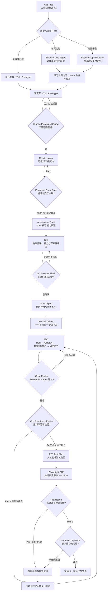

# Ops Vibe Coding

> Operations-first workflow for turning infrastructure ideas into tested software.

面向 SRE、DevOps、Platform Engineer 和运维开发的 AI 原生软件开发工作流：从一个业务问题或可交互原型开始，经过产品确认、架构决策、规格定义、TDD、运维就绪审查和真实浏览器验收，把运维想法变成可运行、可验证的软件。

你不需要先会写前端，也不需要一开始就能写出完整 PRD。不会制作原型时，可以直接从 [Beautiful Ops Pages](https://github.com/luozijian1990/Beautiful-Ops-Pages) 或 [Beautiful Ops Platform](https://github.com/luozijian1990/Beautiful-Ops-Platform) 选择接近的页面，改成自己的业务场景，再沿着本项目的流程继续完成工程化。

> [!TIP]
> 对非前端背景的运维工程师来说，现成原型是表达产品意图的起点，不是最终产品。先让真实使用者看见、点击并确认“是不是想要的东西”，再投入正式开发。

## 这是什么

Ops Vibe Coding 不是新的 Agent Framework、Prompt 合集或后台模板。它是一套 `operations-first` 方法，把原型、架构、Spec、实现和验收连接成一条有明确产物、反馈和人工门禁的 Golden Path。

它重点解决一个实际问题：

> 一个懂运维业务、但未必具备产品设计和完整软件开发经验的人，如何在 AI Agent 协助下，把想法逐步变成真正可用的软件？

在这条路径里：

- HTML Prototype 是低成本的可执行需求；
- React + Mock 是可运行的产品契约；
- Architecture 确定系统组成和运行边界；
- Spec 确定系统精确行为与验收条件；
- 测试、审查、E2E 和人工验收构成证据闭环。

## 不会做原型？从现成的开始

两个公开原型库为不同粒度的运维想法提供起点：

| 原型库 | 适合的起点 | 可以用它做什么 |
|---|---|---|
| [Beautiful Ops Pages](https://github.com/luozijian1990/Beautiful-Ops-Pages) | 单页功能或具体任务 | 参考 Kubernetes、主机、网络、告警、Incident、Trace 等单页交互，改写文案、Mock 数据和操作流程 |
| [Beautiful Ops Platform](https://github.com/luozijian1990/Beautiful-Ops-Platform) | 完整平台或复杂工作台 | 参考完整导航、信息架构、跨区域工作流和平台级页面组织，改造成自己的运维平台原型 |

推荐做法：

1. 写清楚谁遇到了什么问题，以及怎样算解决；
2. 在两个原型库中选择最接近的页面或平台；
3. 让 AI Agent 保留其视觉语言，替换业务文案、Mock 数据和场景交互；
4. 交给真实使用者体验并调整，直到产品意图获得批准；
5. 将批准后的原型转成 React + Mock，再进入架构与实现阶段。

> [!IMPORTANT]
> 两个原型库中的操作和数据均为 Mock。它们用于探索与确认产品意图，不连接真实生产系统，也不代表已经满足安全或生产就绪要求。

原型确认后的工程化转换遵守一个原则：

> 组件库服从已经批准的原型，而不是让原型服从组件库。

## 完整流程

这不是一条只向前走的代码生成流水线。Parity、Review、Ops Readiness 或 E2E 发现问题后，都要回到对应阶段修正并重新提供证据；AI 不能用“应该可用”代替验证。

## 10 分钟理解每个阶段

| 阶段 | 回答的问题 | 关键产物 | 人工门禁 |
|---|---|---|---|
| Prototype | 用户如何使用？ | HTML Prototype、批准记录 | 批准页面、流程与交互 |
| React + Mock | 产品契约是否可执行？ | React App、Mock API/Data | Parity 报告通过 |
| Architecture | 系统由什么组成？ | Draft、Grill 决策、Final | 确认运行与风险约束 |
| Spec + Tickets | 系统精确如何工作？ | Spec、纵向切片 Tickets | 批准范围与验收条件 |
| TDD + Review | 实现是否正确？ | 代码、测试、Review | 阻断问题解决 |
| Ops + E2E | 能否安全运行并解决问题？ | Readiness、E2E 报告 | 批准测试边界并最终验收 |

前端只能暴露能力候选，不能直接决定 Redis、MQ、Worker、WebSocket 或微服务：

> UI 告诉我们系统需要做什么；Grill 告诉我们系统必须在什么约束下运行；两者共同决定架构。

## 适合谁

- 打算学习 Vibe Coding、希望借助 AI Agent 把运维想法变成软件，但不知道从哪一步开始的运维工程师；
- 熟悉运维业务，但不一定具备产品、前端或全栈开发经验的人；
- 正在建设 Kubernetes、监控告警、Incident、AIOps 或远程执行工具的团队；
- 希望让 Claude Code、Codex、OpenCode 等 Agent 参与开发，同时保留人工决策门禁的人；
- 需要把 Demo 逐步演进为长期维护或生产使用的软件的人。

## 从这里开始

- 第一次体验、Demo 或低风险小工具：阅读 [Quick Start](docs/01-quick-start.md)，走 [Lightweight Track](workflows/lightweight.md)。
- 想直接查看 Full Track 每个阶段会留下什么：阅读 [Kubernetes Deployment Restart Golden Path](examples/kubernetes-deployment-restart/README.md) 教学示例。
- 想让 Codex、Claude Code、OpenCode 等 Agent 在多个 Ticket 和多个 Session 中稳定遵循这套流程：阅读 [Harness Engineering](harness/README.md)。
- 团队工具、长期维护、生产或敏感操作：直接走 [Full Track](workflows/full.md)。
- 想理解每个阶段为什么这样设计：阅读阶段深潜系列 [02](docs/02-prototype-first.md) → [03](docs/03-architecture-and-sdd.md) → [04](docs/04-context-engineering.md) → [05](docs/05-tdd-and-feedback-loop.md) → [06](docs/06-ops-readiness.md) → [07](docs/07-e2e-and-human-acceptance.md)。
- 快速消疑：查看 [FAQ](docs/08-faq.md)。
- 想知道每一步留下什么：查看 [Artifact Map](references/artifacts.md)。
- 想知道各阶段如何复用现有能力：查看 [Skill Map](references/skills.md)。

Lightweight Track 会缩短文档与审查深度，但不会跳过产品意图与架构约束的人工确认，也不代表生产就绪。涉及生产基础设施、Secret、远程执行、多租户、审批、长任务或明显业务风险时，应升级到 Full Track。

## 核心原则

- **Prototype before expensive code**：尽量在低成本原型阶段发现产品问题。
- **Human approves intent, AI executes detail**：AI 执行细节，人决定需求、架构、风险和验收。
- **UI reveals capabilities, grilling reveals constraints**：不从 UI 直接脑补完整架构。
- **Evidence before complexity**：没有具体证据，不增加基础设施复杂度。
- **One ticket, one context**：一个 Ticket 使用一个新会话，降低上下文污染。
- **Specs are executable contracts**：Spec 必须能够指导实现与测试。
- **Tests are evidence**：不能用“应该可用”代替可复现验证。
- **Operations are part of software design**：权限、审计、Secret、恢复、部署和可观测性属于设计本身。
- **Human acceptance closes the loop**：最终由人确认软件是否解决最初的问题。

## 项目生态与仓库边界

| 项目 | 职责 |
|---|---|
| `ops-vibe-coding` | 维护方法论、工作流、教程、引用和示例，定义 Operations-first Golden Path |
| [Beautiful Ops Pages](https://github.com/luozijian1990/Beautiful-Ops-Pages) | 提供可直接体验和改写的单页功能原型 |
| [Beautiful Ops Platform](https://github.com/luozijian1990/Beautiful-Ops-Platform) | 提供可直接体验和改写的完整运维平台原型 |
| [`personal-skill`](https://github.com/luozijian1990/personal-skill) | 独立维护流程所引用的可执行 Skills |

本仓库引用现有原型和 Skills，但不复制它们的实现。首版也刻意不提供 CLI、Agent Framework、低代码平台或大量 Demo；目标是先让一条面向运维场景的完整路径清楚、可执行、可验证。
